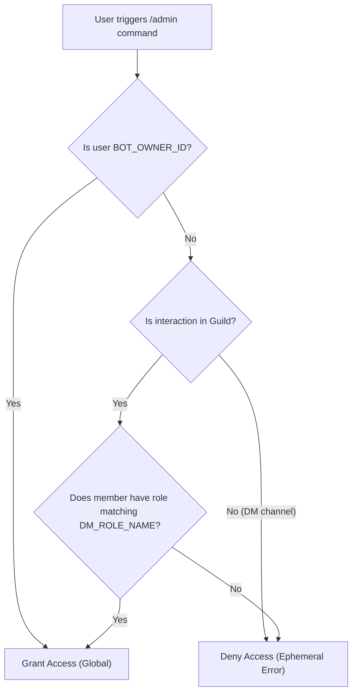

# Dungeon Master (DM) Permissions Guide

**Audience**: Discord Server Administrators, Bot Hosters, and Campaign Dungeon Masters  
**Version**: 2.0  
**Feature**: Discord Role-Based Permissions & Admin Commands

---

## 📖 Overview

EverReach West Marches Assistant uses Discord's native role hierarchy to manage administrative and Dungeon Master permissions. Instead of requiring database-stored roles or complex permissions tables, the bot inspects the user's assigned Discord roles directly within the guild.

This approach provides several key benefits:
- **Zero Database Overhead**: Role changes take effect immediately in Discord without needing bot restarts or DB synchronization.
- **Guild Isolation**: A user with a Dungeon Master role in Server A has zero administrative power in Server B unless explicitly granted the role there.
- **Server Admin Control**: Server owners and administrators retain full control over who gets DM privileges using standard Discord role management.
- **Global Bot Owner Override**: The bot owner (`BOT_OWNER_ID`) holds global superadmin rights across all servers and direct messages (DMs).

---

## ⚙️ Prerequisites

For the permission system to operate correctly, two prerequisites must be met:

### 1. Privileged Gateway Intent Enabled
The bot must have the **Server Members Intent** enabled in the Discord Developer Portal.
- Go to: [Discord Developer Portal](https://discord.com/developers/applications)
- Select your Application → **Bot** tab
- Scroll down to **Privileged Gateway Intents**
- Enable **Server Members Intent** (`IntentsBitField.Flags.GuildMembers`)
- Save changes

### 2. Bot Role Hierarchy
The bot's integrated role must have permissions to view server members (`View Channel`, `Read Message History`). Ensure the bot role is positioned appropriately in your server settings.

---

## 🛠️ Step-by-Step Server Admin Setup

Follow these steps to designate Dungeon Masters on your Discord server:

### Step 1: Open Server Settings
1. Open Discord and navigate to your West Marches server.
2. Click the server name dropdown in the top left and select **Server Settings** (`⚙️`).

### Step 2: Create the Role
1. Navigate to the **Roles** tab.
2. Click **Create Role**.
3. Name the role **`Dungeon Master`** (matching `DM_ROLE_NAME` in `.env`, or see [Custom Role Names](#custom-role-names) below).
   > [!TIP]
   > The permission matching is **case-insensitive**. "Dungeon Master", "dungeon master", and "DUNGEON MASTER" all match.
4. Pick a distinguishing color (e.g., Purple `#9d4edd`) and save changes.

### Step 3: Assign the Role to Your DMs
1. Go to the **Manage Members** tab of the role (or right-click any member in the member list).
2. Click **Add Members** and select the Dungeon Masters in your campaign.
3. Save changes.

### Step 4: Verify with `/admin dm-list`
In any server channel where the bot has access, run:
```slash
/admin dm-list
```
The bot will query the guild members and display an embed listing all recognized Dungeon Masters.

---

## 🔧 Environment Configuration

Hosters can customize the owner ID and role name in their `.env` file:

```env
# Discord User ID of the bot creator/hoster (Global Superadmin)
BOT_OWNER_ID=123456789012345678

# The Discord role name required for DM commands in servers (Default: "Dungeon Master")
DM_ROLE_NAME="Dungeon Master"
```

### Getting Your Discord User ID (`BOT_OWNER_ID`)
1. In Discord, go to **User Settings** (`⚙️`) → **Advanced**.
2. Turn on **Developer Mode**.
3. Right-click your profile / username in any channel or member list.
4. Click **Copy User ID**.
5. Paste this number into `BOT_OWNER_ID` in `.env`.

### Custom Role Names
If your campaign uses "Game Master", "DM", or "Storyteller" instead:
1. Set `DM_ROLE_NAME="Game Master"` in `.env`.
2. Restart the bot.
3. `/admin` commands will now check for the "Game Master" role on the server.
4. Note: `/admin dm-list` additionally identifies roles containing `dungeon`, `master`, or matching `dm`.

---

## 📜 Admin & DM Commands Reference

All administrative commands are housed under the `/admin` command group and protected by the `DungeonMasterGuard`. Regular players attempting to run these commands receive an ephemeral permission denied notification.

| Command | Arguments | Description | Permission |
|---------|-----------|-------------|------------|
| `/admin item-add` | `key: string`, `name: string`, `value: number` | Adds a new global catalog item to the database shop/auctions. | DM Role or Bot Owner |
| `/admin item-update` | `key: string`, `name?: string`, `value?: number` | Updates an existing item's name or base gold value. | DM Role or Bot Owner |
| `/admin item-delete` | `key: string` | Deletes an item from the database (cascades to inventory and auctions). | DM Role or Bot Owner |
| `/admin item-list` | *none* | Lists all items registered in the database catalog with keys and values. | DM Role or Bot Owner |
| `/admin dm-list` | *none* | Displays all members in the current server holding the DM role. *(Guild-only)* | DM Role or Bot Owner |

### Examples

#### Adding a New Magical Item
```slash
/admin item-add key:flame_tongue name:Flame Tongue Longsword value:5000
```

#### Updating an Item's Price
```slash
/admin item-update key:healing_potion value:75
```

#### Deleting an Obsolete Item
```slash
/admin item-delete key:test_sword
```

---

## 🔒 Security Architecture

### Permission Resolution Flow


1. **Bot Owner Bypass**: If `interaction.user.id === BOT_OWNER_ID`, access is instantly granted anywhere (including direct messages with the bot).
2. **Guild Context Required for Non-Owners**: If a non-owner runs an admin command in bot DMs, access is denied.
3. **Guild Member Role Check**: In a server, `interaction.member.roles` is checked against `DM_ROLE_NAME` using case-insensitive string matching.
4. **Audit Logging**: Failed access attempts are logged via NestJS Logger with user ID and guild context for administrative auditing.

---

## ❓ Frequently Asked Questions & Troubleshooting

### Q: Why do users with the DM role get "Permission Denied"?
1. **Server Members Intent**: Ensure **Server Members Intent** is enabled in the Discord Developer Portal under the Bot tab. Without this intent, Discord does not send guild member roles to the bot.
2. **Role Name Mismatch**: Check that the role name in Discord matches `DM_ROLE_NAME` in `.env` (default: `Dungeon Master`).
3. **Role Assigned**: Verify the user actually has the role assigned in the server.

### Q: Can a Dungeon Master delete items created by another DM?
Yes. Items in the database catalog are shared across the bot's campaign instance. Any designated DM or the bot owner can add, update, or remove items.

### Q: What happens to active auctions or inventories if an item is deleted?
The database schema defines cascade rules: deleting an item will remove associated shop entries, active auctions, and character inventories. Use caution when deleting items with `/admin item-delete`.
